# Pipeline - Codex

[](https://developers.openai.com/codex/)
[](https://github.com/IvanMurzak/pipeline-codex/releases)
[](https://www.npmjs.com/package/@baizor/pipeline)
[](LICENSE)



**Long AI work, as ordered files in your repo.** A pipeline is a folder of
numbered markdown steps. A deterministic CLI decides what runs next — not the
model — and every step gets a fresh context, so a chain that takes hours never
drags a hundred thousand tokens of history behind it.

Two commands. The second one from the project where you want pipelines to live.

## Install

```bash
bun add -g @baizor/pipeline
pipeline init --local
```


`pipeline init` clones a starter pipeline into `./.pipeline/support-answer`,
serves a local dashboard, and leaves you with something you can run immediately.
Then add the Codex plugin so Codex knows how to read and advance those files:

```bash
codex plugin marketplace add IvanMurzak/pipeline-codex-marketplace
codex plugin install pipeline@pipeline
```

> The marketplace id is `pipeline`; it also carries
> [`taskflow`](https://github.com/IvanMurzak/taskflow-codex), which installs as
> `taskflow@pipeline`.

<details>
<summary><b>Prerequisites, and connecting to the cloud instead of <code>--local</code></b></summary>

<br>

**Bun is required, not preferred** — the CLI's executable is TypeScript.
`pipeline init` stops immediately with the install URL if `bun` isn't found.

Drop the `--local` and `pipeline init` also connects the project to
[ai-pipeline.dev](https://ai-pipeline.dev) through a single browser consent
screen, so runs appear on the dashboard below. You do not need an account first;
signing in creates one, and your first organization is created for you. A failed
or declined connect is a warning, not an error — `init` finishes locally and
exits 0, and `pipeline cloud connect` picks it up later.

Under `--json` no browser is ever opened: set `PIPELINE_MACHINE_TOKEN` to connect
non-interactively (CI, bots, agents), or the cloud step is skipped with a stated
reason and the rest still runs.

</details>

## Using it

Ask Codex to work the pipeline. The skill activates on its own when a task is
about designing or advancing a file-based pipeline, so plain words are enough:

```text
advance the support-answer pipeline to its next step
```

```text
design a release pipeline — changelog, version bump, tag, GitHub release
```

The rules it follows are deliberately conservative, because a pipeline is a
record as much as a plan:

- `.pipeline/<name>/PIPELINE.md` and its ordered step files are the **source of
  truth** — not the conversation, and not what a previous run remembers.
- It **inspects the repository before changing anything**, and preserves the
  evidence a completed step left behind.
- It advances **one explicit next step at a time**. No skipping ahead, no
  batching several steps into one edit.
- If the `pipeline` CLI isn't installed it says which runtime is missing and
  prepares the next step anyway — it never invents command output it did not get.

## Watch it run, from anywhere


Connect the project (`pipeline init` without `--local`) and every run shows up
live on [**ai-pipeline.dev**](https://ai-pipeline.dev) — status, step, elapsed,
tokens, cost — with pipelines rendered as node graphs that light up as they
execute. A run that parks for your approval says so, and you can answer it from
the dashboard or from your phone.

It runs on your metal. The cloud is a control plane, not a proxy: your
subscription, your API keys, your machines, and model traffic never touches it.
Metadata only by default — statuses, timings and token counts leave, transcripts
and code do not, unless you opt up per project. `--local` opts out of all of it
and serves the same dashboard at `http://127.0.0.1:<port>/`.

---

## What this package is, and is not

This is the **Codex adapter**: one skill that teaches Codex the pipeline file
format and the discipline for advancing it. It is deliberately small.

| | Here | [pipeline-claude](https://github.com/IvanMurzak/pipeline-claude) |
|---|---|---|
| Pipeline file format and step discipline | ✅ | ✅ |
| The `pipeline` CLI | separate global install | separate global install |
| `design` / `run` / `dispatch` / `find` / `clone` skills | — | ✅ |
| Six coordinated agents (manager, step-executor, improver, script-creator, disambiguator) | — | ✅ |
| Hooks, local UI, departments MCP | — | ✅ |

Everything the CLI does — `clone`, `run`, `logs`, `ci-wait`, `department`,
`worktree` — works from a bare terminal on either host, because it is one
globally installed binary and not part of a plugin.

## Where things live

```text
.pipeline/<name>/
├── PIPELINE.md          the manifest — what this pipeline is for
├── 01-<step>.md         ordered step files, each one PR-sized
├── 02-<step>.md
└── scripts/             deterministic work extracted out of the markdown
```

A step file carries its own Goal, Context, Inputs, Steps, Success Criteria and
Next. It is self-contained on purpose: every run reads it with a fresh context,
so anything it does not say is not known.

## Related

- [`IvanMurzak/pipeline-claude`](https://github.com/IvanMurzak/pipeline-claude) — the full Claude Code build
- [`IvanMurzak/taskflow-codex`](https://github.com/IvanMurzak/taskflow-codex) — plan → review → tasks → execute, for Codex
- [`IvanMurzak/pipeline-runner`](https://github.com/IvanMurzak/pipeline-runner) — the runner that lets connected compute pick up dispatched work

## License

[MIT](LICENSE) © Ivan Murzak
